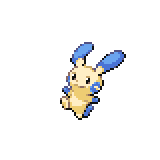
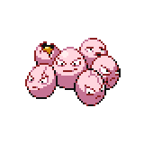
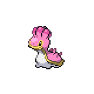
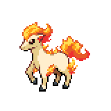

=== "Wild Encounters"

	???+ note "Grass Lv. 21-24"
		

                     [Wingull](/pokemon-umbral-stasis/pokemon/278-wingull) 25%
                

                     [Minun](/pokemon-umbral-stasis/pokemon/312-minun) 20%
                

                     [Exeggcute](/pokemon-umbral-stasis/pokemon/102-exeggcute) 20%
                

                     [Plusle](/pokemon-umbral-stasis/pokemon/311-plusle) 20%
                

                     [Shellos](/pokemon-umbral-stasis/pokemon/422-shellos) 15%
                

                     [Ponyta](/pokemon-umbral-stasis/pokemon/077-ponyta) 10%
                

                     [Buizel](/pokemon-umbral-stasis/pokemon/418-buizel) 10%
                

