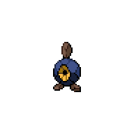
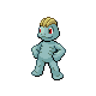
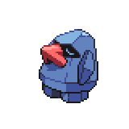

=== "Wild Encounters"

	???+ note "Cave Lv. 11-15"
		

                     [Zubat](/pokemon-umbral-stasis/pokemon/041-zubat) 40%
                

                     [Geodude](/pokemon-umbral-stasis/pokemon/074-geodude) 20%
                

                     [Roggenrola](/pokemon-umbral-stasis/pokemon/524-roggenrola) 20%
                

                     [Machop](/pokemon-umbral-stasis/pokemon/066-machop) 10%
                

                     [Onix](/pokemon-umbral-stasis/pokemon/095-onix) 5%
                

                     [Nosepass](/pokemon-umbral-stasis/pokemon/299-nosepass) 5%
                

