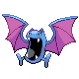
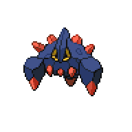
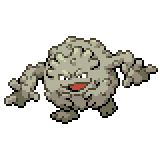
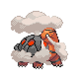
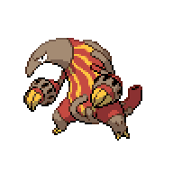

=== "Wild Encounters"

	???+ note "Cave Lv. 27-32"
		

                     [Slugma](/pokemon-umbral-stasis/pokemon/218-slugma) 20%
                

                     [Golbat](/pokemon-umbral-stasis/pokemon/042-golbat) 20%
                

                     [Boldore](/pokemon-umbral-stasis/pokemon/525-boldore) 20%
                

                     [Graveler](/pokemon-umbral-stasis/pokemon/075-graveler) 20%
                

                     [Torkoal](/pokemon-umbral-stasis/pokemon/324-torkoal) 15%
                

                     [Heatmor](/pokemon-umbral-stasis/pokemon/631-heatmor) 5%
                

