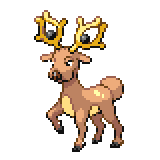
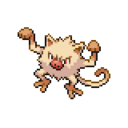

=== "Wild Encounters"

	???+ note "Grass Lv. 20-23"
		

                     [Stantler](/pokemon-umbral-stasis/pokemon/234-stantler) 20%
                

                     [Phanpy](/pokemon-umbral-stasis/pokemon/231-phanpy) 20%
                

                     [Mankey](/pokemon-umbral-stasis/pokemon/056-mankey) 20%
                

                     [Sandshrew](/pokemon-umbral-stasis/pokemon/027-sandshrew) 20%
                

                     [Scraggy](/pokemon-umbral-stasis/pokemon/559-scraggy) 10%
                

                     [Bronzor](/pokemon-umbral-stasis/pokemon/436-bronzor) 10%
                

