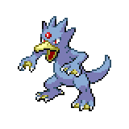
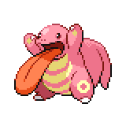

=== "Wild Encounters"

	???+ note "Grass Lv. 36-40"
		

                     [Slowpoke](/pokemon-umbral-stasis/pokemon/079-slowpoke) 30%
                

                     [Pelipper](/pokemon-umbral-stasis/pokemon/279-pelipper) 30%
                

                     [Golduck](/pokemon-umbral-stasis/pokemon/055-golduck) 25%
                

                     [Lickitung](/pokemon-umbral-stasis/pokemon/108-lickitung) 10%
                

                     [Kangaskhan](/pokemon-umbral-stasis/pokemon/115-kangaskhan) 5%
                

