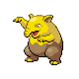

=== "Wild Encounters"

	???+ note "Grass Lv. 12-16"
		

                     [Snubbull](/pokemon-umbral-stasis/pokemon/209-snubbull) 30%
                

                     [Drowzee](/pokemon-umbral-stasis/pokemon/096-drowzee) 30%
                

                     [Nidoran-m](/pokemon-umbral-stasis/pokemon/032-nidoran-m) 15%
                

                     [Nidoran-f](/pokemon-umbral-stasis/pokemon/029-nidoran-f) 15%
                

                     [Seedot](/pokemon-umbral-stasis/pokemon/273-seedot) 10%
                

                     [Joltik](/pokemon-umbral-stasis/pokemon/613-joltik) 5%
                

