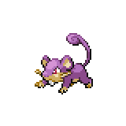
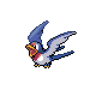
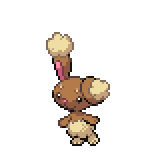

=== "Wild Encounters"

	???+ note "Grass Lv. 4-6"
		

                     [Zigzagoon](/pokemon-umbral-stasis/pokemon/263-zigzagoon) 18%
                

                     [Starly](/pokemon-umbral-stasis/pokemon/399-starly) 18%
                

                     [Pidgey](/pokemon-umbral-stasis/pokemon/016-pidgey) 18%
                

                     [Rattata](/pokemon-umbral-stasis/pokemon/019-rattata) 18%
                

                     [Taillow](/pokemon-umbral-stasis/pokemon/276-taillow) 18%
                

                     [Buneary](/pokemon-umbral-stasis/pokemon/434-buneary) 10%
                

