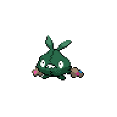

=== "Wild Encounters"

	???+ note "Grass Lv. 16-19"
		

                     [Trubbish](/pokemon-umbral-stasis/pokemon/568-trubbish) 25%
                

                     [Grimer](/pokemon-umbral-stasis/pokemon/088-grimer) 25%
                

                     [Koffing](/pokemon-umbral-stasis/pokemon/109-koffing) 25%
                

                     [Pidove](/pokemon-umbral-stasis/pokemon/519-pidove) 17%
                

                     [Purrloin](/pokemon-umbral-stasis/pokemon/509-purrloin) 8%
                

