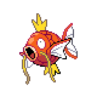
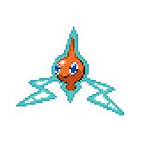

=== "Wild Encounters"

	???+ note "Surfing Lv. 12-22"
		

                     [Goldeen](/pokemon-umbral-stasis/pokemon/118-goldeen) 70%
                

                     [Wooper](/pokemon-umbral-stasis/pokemon/194-wooper) 15%
                

                     [Surskit](/pokemon-umbral-stasis/pokemon/283-surskit) 15%
                

	???+ note "Old Rod Lv. 4-12"
		

                     [Magikarp](/pokemon-umbral-stasis/pokemon/129-magikarp) 90%
                

                     [Poliwag](/pokemon-umbral-stasis/pokemon/060-poliwag) 10%
                

	???+ note "Good Rod Lv. 10-18"
		

                     [Magikarp](/pokemon-umbral-stasis/pokemon/129-magikarp) 65%
                

                     [Poliwag](/pokemon-umbral-stasis/pokemon/060-poliwag) 20%
                

                     [Tympole](/pokemon-umbral-stasis/pokemon/551-tympole) 10%
                

                     [Feebas](/pokemon-umbral-stasis/pokemon/349-feebas) 5%
                

	???+ note "Super Rod Lv. 20-28"
		

                     [Magikarp](/pokemon-umbral-stasis/pokemon/129-magikarp) 40%
                

                     [Poliwag](/pokemon-umbral-stasis/pokemon/060-poliwag) 25%
                

                     [Tympole](/pokemon-umbral-stasis/pokemon/551-tympole) 20%
                

                     [Feebas](/pokemon-umbral-stasis/pokemon/349-feebas) 15%
                

	???+ note "Special Lv. 30"
		

                     [Rotom](/pokemon-umbral-stasis/pokemon/486-rotom) 100%
                

